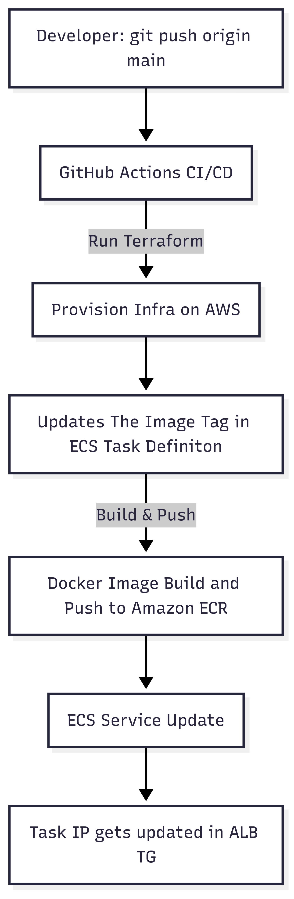

# Node.js Static HTML App Deployment to AWS ECS  

This project demonstrates deploying a **Node.js application (static HTML serving)** to **AWS ECS** using **Terraform** for infrastructure and **GitHub Actions** for CI/CD automation.  

---

## Architecture Flow

  

---

## How It Works  

1. **Terraform** provisions AWS infrastructure:  
   - ECS Cluster & Service  
   - ECR Repository  
   - Application Load Balancer (ALB) in **public subnets**  
   - ECS tasks running in **private subnets**  
   - Networking (VPC, Subnets, Security Groups, etc.)  

2. **Traffic Flow**:  
   - The **ALB** accepts incoming requests from the internet.  
   - Traffic is securely routed from the ALB in the public subnet → to ECS tasks in private subnets.  
   - This ensures tasks are not directly exposed to the internet, improving security.  

---

## GitHub Actions CI/CD  

Workflow (`.github/workflows/deploy.yml`) automates deployment on every push to `main`:  

- Configures AWS credentials via OIDC (no static keys).  
- Runs `terraform init`, `plan`, and `apply`.  
- Builds Docker image of the app and pushes it to Amazon ECR.  
- Forces ECS service to pull the new image and redeploy.  

---

## Repository Structure  

```
.
├── Application/      # Node.js static app + Dockerfile
├── Terraform/        # IaC for ECS, ECR, networking, ALB
└── .github/workflows # GitHub Actions pipeline
```

---

## Required Setup  

### GitHub → **Variables**  
- `AWS_REGION` – AWS region (e.g., `ap-south-1`)  
- `ECR_REPOSITORY` – ECR repo name  
- `ECS_CLUSTER` – ECS cluster name  
- `ECS_SERVICE` – ECS service name  

### GitHub → **Secrets**  
- `AWS_ROLE_TO_ASSUME` – IAM role with ECS/ECR/Terraform permissions  

---

## Run Locally  

### 1. Run Application with Docker  

```bash
cd Application
docker build -t myapp .
docker run -p 8080:80 myapp
```

App will be available at: **http://localhost:8080**

---

### 2. Provision Infrastructure with Terraform  

```bash
cd Terraform
terraform init
terraform plan -out=tfplan
terraform apply -auto-approve tfplan
```


## Highlights  

- **Infrastructure as Code** with Terraform  
- **Application Load Balancer** for secure, scalable internet-facing traffic routing  
- **Private ECS Tasks** for enhanced security (not directly exposed to internet)  
- **Secure CI/CD** with GitHub Actions + AWS OIDC  
- **Immutable Deployments** using Git commit SHA tags  
- **Zero-downtime updates** with ECS rolling deployments  

---

[def]: architecture.png